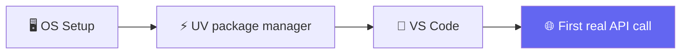

# 🐍 Class 01 — Python for AI: Dev Environment & Fundamentals
**📅 27 June 2026** · Agentic AI 3.0 Specialization · Mentor: Mayank Aggarwal

📖 **[Full class summary, diagrams & Q&A →](<../classes_summary/01 - 27 Jun - Python Setup & API Basics.md>)**



Dev environment setup (Python 3.10+, UV, VS Code, Git Bash for Windows), core Python fundamentals, and the first live API call — a currency-exchange lookup that previews exactly how every LLM call in this course will be shaped.

## 📂 Files in This Folder

| File | What it is |
|---|---|
| `Python_foundamentals.py` | Variables, types, f-strings, control flow, functions + docstrings |
| `OOPS.py` | First object-oriented Python pass |
| `currency.py` | Live currency-exchange API call with `requests` |
| `functions or tools.py`, `tools.py` | Function design previewing agent "tools" |
| `notebook.ipynb` | Companion exploration notebook |
| [`my-first-project/`](<my-first-project/>) | A real `uv init` project — `pyproject.toml`, lockfile and all |

## ▶️ Run It

```bash
uv venv && source .venv/bin/activate   # Windows: .venv\Scripts\activate
uv add requests
uv run currency.py
```

---
⬅️ [Course index](<../README.md>) · ➡️ [Class 02-03](<../02-03 - 28 Jun & 4 Jul - Python Refresher & Pydantic Deep Dive/README.md>)
