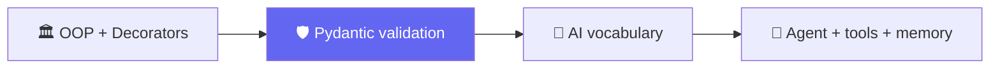

# 🧱 Class 02-03 — Python Refresher & Pydantic Deep Dive
**📅 28 June & 4 July 2026** · Agentic AI 3.0 Specialization · Mentor: Mayank Aggarwal

📖 **[Class 02 summary →](<../classes_summary/02 - 28 Jun - Python Refresher.md>)** · **[Class 03 summary →](<../classes_summary/03 - 4 Jul - Pydantic Deep Dive.md>)**



This folder is an expanded, self-contained codebase spanning OOP/decorators (Class 02) through Pydantic (Class 03) and previewing the tool-and-memory agent pattern that Classes 04-05 build in full. Also included: a standalone [`8_Pydantic/`](<8_Pydantic/>) mini-project.

---

## Class 2 — Pydantic — Expanded Starter Codebase
**15 standalone files, basics through a memory-holding, multi-tool agent.**
**Real currency API (free). Real LLM via Groq and/or OpenRouter (free). OpenAI shown, not required.**

Agentic AI 3.0 · Phase 0 · Class 2 of 4

## Files, in teaching order

| File | Covers | Agent/AI mentioned? |
|---|---|---|
| `_0_basics_refresher.py` | Quick Class 1 recap | No |
| `_1_data_structures.py` | Lists, dicts, tuples, list-of-dicts | No |
| `_2_oop_classes.py` | Classes — BankAccount, Book (no Agent) | No |
| `_3_error_handling.py` | try/except, multiple patterns | No |
| `_4_decorators.py` | The wrapper pattern, generic | No |
| `_5_calling_a_real_api.py` | `requests`, real currency conversion | First real API, no AI |
| `_6_fake_ai_call.py` | The OpenAI-style shape, zero dependency | First AI mention |
| `_7_ai_call_free_and_paid.py` | Groq, OpenRouter (free), OpenAI (paid, shown not required) | Yes |
| `_8_pydantic_with_ai.py` | **Main topic.** BaseModel, Field, validators, nested models, validating LLM output | Yes |
| `_9_api_call_with_structure.py` | File 5's API call, now Pydantic-validated | No new AI, just structure |
| `_10_tool_with_ai_call.py` | Validated tool + AI call, side by side, decorator applied for real | Yes |
| `_11_agent_class_ai_only.py` | Agent via OOP (File 2's pattern), brain only | Yes |
| `_12_agent_with_one_tool.py` | Same agent, + the currency tool | Yes |
| `_13_agent_with_more_tools.py` | + weather, + calculator (3 tools total) | Yes |
| `_14_agent_with_memory.py` | Memory named explicitly + everything combined | Yes |

Numbering uses a leading underscore (`_0_`, `_1_`...) — same reason as before: Python can't `import` a file starting with a bare digit, but a leading underscore sorts and reads the same way while staying importable.

**Every file is self-contained and runnable on its own** — none of them require running the others first, even though later files reuse earlier patterns by re-declaring them (not importing across the whole chain), so you can hand any single file to a student without the rest.

## Setup

You already have `uv` from Class 1.
```bash
uv add requests pydantic python-dotenv
```
Optional, for real AI calls (every file falls back automatically without this):
```bash
uv add openai
cp .env.example .env   # paste a free Groq and/or OpenRouter key in
```

## Run things in this order

```bash
uv run _0_basics_refresher.py
uv run _1_data_structures.py
uv run _2_oop_classes.py
uv run _3_error_handling.py
uv run _4_decorators.py
uv run _5_calling_a_real_api.py
uv run _6_fake_ai_call.py
uv run _7_ai_call_free_and_paid.py
uv run _8_pydantic_with_ai.py
uv run _9_api_call_with_structure.py
uv run _10_tool_with_ai_call.py
uv run _11_agent_class_ai_only.py
uv run _12_agent_with_one_tool.py
uv run _13_agent_with_more_tools.py
uv run _14_agent_with_memory.py
```

## A note on testing

Files `_5`, `_7`, `_9`, `_10`, `_12`, `_13`, `_14` make real network calls (Frankfurter and/or Groq/OpenRouter). Every line of request-building, response-parsing, and Pydantic validation was tested — including every failure path (bad input, missing key, network timeout) — using mocked responses that match each provider's exact documented response shape. The live calls themselves need a real internet connection to complete; this build environment's network policy blocks those specific domains directly, so budget a few minutes before class to run each once for real.

## The one rule for this folder

If you can't point to which earlier file taught a pattern reused later, that pattern doesn't belong here yet.

---
⬅️ [Class 01](<../01 - 27 Jun - Python Setup & API Basics/README.md>) · [Course index](<../README.md>) · ➡️ [Class 04-05](<../04-05 - 5 Jul & 11 Jul - Anatomy of an Agent & The Agentic Loop/README.md>)
