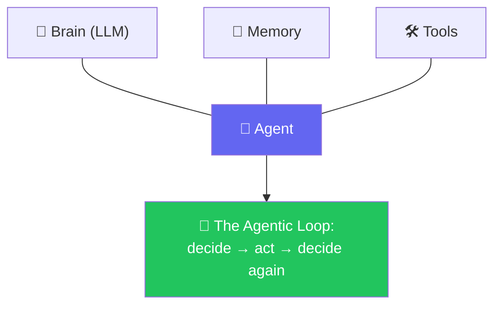

# 🤖 Class 04-05 — Anatomy of an Agent & The Agentic Loop
**📅 5 July & 11 July 2026** · Agentic AI 3.0 Specialization · Mentor: Mayank Aggarwal

📖 **[Class 04 summary →](<../classes_summary/04 - 5 Jul - Anatomy of an Agent.md>)** · **[Class 05 summary →](<../classes_summary/05 - 11 Jul - The Agentic Loop.md>)**

Two weekends building a real agent in **pure Python, no framework**: the Brain → Memory → Tools anatomy (Class 04), then the full agentic loop with a terminal chat and a Streamlit front end (Class 05). Everything here is hand-rolled on purpose — LangChain begins the following class, and this is exactly the loop it automates.

## 📂 Files — [`Project 0/`](<Project 0/>)

| File | Class | Covers |
|---|---|---|
| `_01_ai_model_vs_chatbot_vs_agent.py` | 04 | Structural comparison, no API calls |
| `_02_calling_the_ai_paid_and_free.py` | 04 | Real calls: OpenAI, Anthropic, Groq, OpenRouter |
| `_03_structuring_with_pydantic.py` | 04 | Structured JSON extraction, validated |
| `_04_giving_it_a_tool.py` | 04 | A weather tool, called manually |
| `_05_teaching_it_to_choose.py` | 05 | Tool schema + the model choosing the tool itself |
| `_06_project_zero_agent.py` | 05 | Full loop, terminal chat, one tool |
| `_07_streamlit_app.py` | 05 | Full loop + Streamlit UI, three tools |

See [`Project 0/README.md`](<Project 0/README.md>) for setup and run instructions.

---
⬅️ [Class 02-03](<../02-03 - 28 Jun & 4 Jul - Python Refresher & Pydantic Deep Dive/README.md>) · [Course index](<../README.md>) · ➡️ [Class 06](<../06 - 12 Jul - Introduction to LangChain/README.md>)
