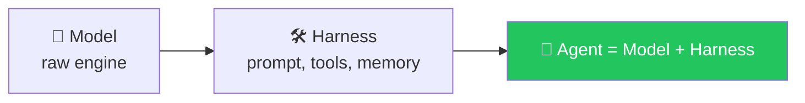

# 🔗 Class 06 — LangChain Begins: From Raw Python to `create_agent()`
**📅 12 July 2026** · Agentic AI 3.0 Specialization · Mentor: Mayank Aggarwal

📖 **[Full class summary, diagrams & Q&A →](<../classes_summary/06 - 12 Jul - Introduction to LangChain.md>)**



This session opens by finishing the raw-Python agent from [Class 05](<../04-05 - 5 Jul & 11 Jul - Anatomy of an Agent & The Agentic Loop/>), then hands the exact same loop over to LangChain's `create_agent()` — the first framework of the course.

## 📂 Files in This Folder

| File | What it is |
|---|---|
| `langchain_basics.py` | First `create_agent()` calls, model swapping |
| `langchain_agents.py` | Tools via `@tool`, the loop delegated to LangChain |
| `main.py` | Entry point |
| `.example.env` | Provider key template — copy to `.env`, never commit the real one |

## ▶️ Run It

```bash
uv sync
cp .example.env .env   # fill in at least one provider key
uv run main.py
```

---
⬅️ [Class 04-05](<../04-05 - 5 Jul & 11 Jul - Anatomy of an Agent & The Agentic Loop/README.md>) · [Course index](<../README.md>) · ➡️ [Class 07-08](<../07-08 - 18-19 Jul - LangChain Family & the Model Layer/README.md>)
