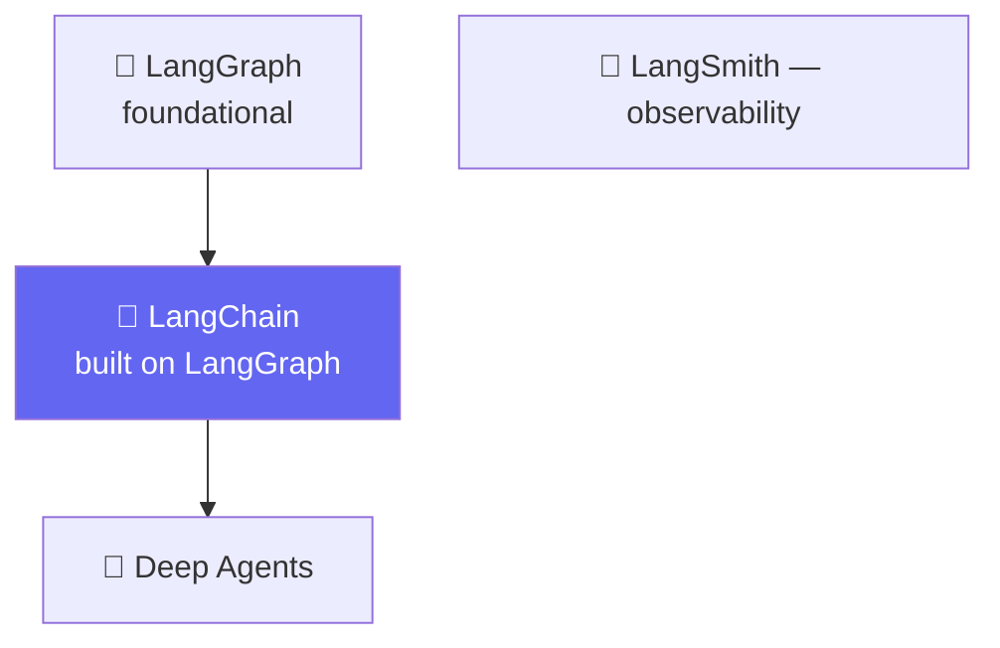

# 🚗 Class 07-08 — LangChain Family, Harness Engineering & the Model Layer
**📅 18-19 July 2026** · Agentic AI 3.0 Specialization · Mentor: Mayank Aggarwal

📖 **[Class 07 summary →](<../classes_summary/07 - 18 Jul - LangChain Family & Harness Engineering.md>)** · **[Class 08 summary →](<../classes_summary/08 - 19 Jul - Inside the Model.md>)**

Two weekends going deep on the model layer: the LangChain family tree (LangGraph → LangChain → Deep Agents, with LangSmith as observability), `init_chat_model`, message types, then temperature/streaming/batching, tool binding, and structured output.

## 📂 What's Here

| Path | Class | Covers |
|---|---|---|
| [`Langchain Practical/langchain-course/`](<Langchain Practical/langchain-course/>) | 07 | Real `uv`-based LangChain project |
| [`Notebook For Reference/01_landscape_student_notes.ipynb`](<Notebook For Reference/01_landscape_student_notes.ipynb>) | 07 | LangChain family + timeline |
| [`Notebook For Reference/02_03_environment_models_messages_student_notes.ipynb`](<Notebook For Reference/02_03_environment_models_messages_student_notes.ipynb>) | 07-08 | Environment, models, messages |
| [`Notebook For Reference/04_05_prompt_templates_structured_output_student_notes.ipynb`](<Notebook For Reference/04_05_prompt_templates_structured_output_student_notes.ipynb>) | 08 | Prompt templates, first structured output |
| [`Notebook For Reference/Revision_Parts_1-4.ipynb`](<Notebook For Reference/Revision_Parts_1-4.ipynb>) | 08 | Consolidated revision, shared before Class 09 |
| [`Notebook For Reference/Langchain_structured_output_tools_agents.ipynb`](<Notebook For Reference/Langchain_structured_output_tools_agents.ipynb>) | 08→09 | Bridges into the CineBot arc |

---
⬅️ [Class 06](<../06 - 12 Jul - Introduction to LangChain/README.md>) · [Course index](<../README.md>) · ➡️ [Class 09-10](<../09-10 - 25-26 Jul - Structured Output & Tools (CineBot)/README.md>)
