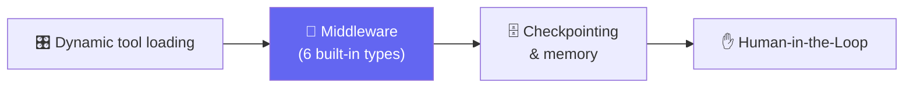

# 🧵 Class 11-12 — Agents, Memory & Middleware Mastery
**📅 1 & 8 August 2026** · Agentic AI 3.0 Specialization · Mentor: Mayank Aggarwal

📖 **[Class 11 summary →](<../classes_summary/11 - 01 Aug - Agents, Middleware & Memory.md>)** · **[Class 12 summary →](<../classes_summary/12 - 08 Aug - Mastering Middleware.md>)**

The most architectural pair of sessions in the course: giving CineBot (and a second, fuller project — **TripMate**) a mind. Dynamic tool loading, VIP-gated tools, headless (client-side) tools, checkpointed memory across conversations, and every built-in LangChain middleware — summarization, human-in-the-loop, call limits, model fallback, and PII detection.

## 📂 What's Here

| File | Class | Covers |
|---|---|---|
| [`Agent-Middleware-Architecture.excalidraw`](<Agent-Middleware-Architecture.excalidraw>) | 11-12 | The full whiteboard diagram of the agent + middleware architecture (open in [excalidraw.com](https://excalidraw.com)) |
| [`Agent-Middleware-Architecture.pdf`](<Agent-Middleware-Architecture.pdf>) | 11-12 | Exported, viewable version of the same diagram |
| [`MIddleware.ipynb`](<MIddleware.ipynb>) | 12 | All six built-in middlewares, worked live |
| [`Middleware-Architecture-Sketch.ipynb`](<Middleware-Architecture-Sketch.ipynb>) | 12 | Early loop-diagram sketch |

🔗 Live Colab used in class: [Middleware notebook](https://colab.research.google.com/drive/1Qt9uU2HhDvtFTWwbbFBYxK86jJypv1w_?usp=sharing)

---
⬅️ [Class 09-10](<../09-10 - 25-26 Jul - Structured Output & Tools (CineBot)/README.md>) · [Course index](<../README.md>)
