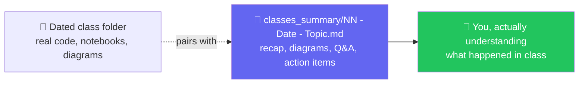
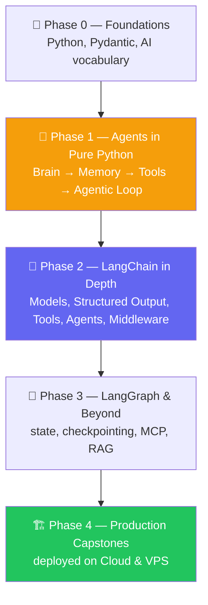

# 🚀 Live Class 2026 — Agentic AI 3.0 Specialization

**All code, notebooks, diagrams, and class-by-class notes for the live Agentic AI 3.0 Specialization with AgentOps.**
🎙️ Mentor: **Mayank Aggarwal** · 🏫 Krish Naik Academy · 🗓️ Every Saturday & Sunday, 8–11 AM IST

📖 **[Mayank's running notes, Colab links & escalated Q&A →](https://bugs-sleep-6uj.craft.me/agentic3)** · 📄 [Full course brochure (PDF)](<Agentic-3-0.pdf>)

---

## 🗺️ How This Repo Is Organized

Every class this course has run lives in its own **dated folder** — code, notebooks, and Excalidraw diagrams exactly as built live — and every class also gets a **beautifully written summary** in [`classes_summary/`](<classes_summary/>), in the spirit of the mermaid-diagram-driven notes format the course community loves.



Open **any** class folder on GitHub and its own `README.md` renders right there with a quick overview and a link to the full write-up — you never have to go hunting for context.

---

## 📚 Class Index

| # | Date(s) | Class | 📖 Summary | 📂 Code |
|---|---|---|---|---|
| 00 | 21 Jun | Course Induction & Roadmap | [notes](<classes_summary/00 - 21 Jun - Course Induction & Roadmap.md>) | — |
| 01 | 27 Jun | Python Setup & API Basics | [notes](<classes_summary/01 - 27 Jun - Python Setup & API Basics.md>) | [`01 - 27 Jun - Python Setup & API Basics/`](<01 - 27 Jun - Python Setup & API Basics/>) |
| 02 | 28 Jun | Python Refresher | [notes](<classes_summary/02 - 28 Jun - Python Refresher.md>) | [`02-03 - 28 Jun & 4 Jul - Python Refresher & Pydantic Deep Dive/`](<02-03 - 28 Jun & 4 Jul - Python Refresher & Pydantic Deep Dive/>) |
| 03 | 4 Jul | Pydantic Deep Dive | [notes](<classes_summary/03 - 4 Jul - Pydantic Deep Dive.md>) | ↑ same folder |
| 04 | 5 Jul | Anatomy of an Agent | [notes](<classes_summary/04 - 5 Jul - Anatomy of an Agent.md>) | [`04-05 - 5 Jul & 11 Jul - Anatomy of an Agent & The Agentic Loop/`](<04-05 - 5 Jul & 11 Jul - Anatomy of an Agent & The Agentic Loop/>) |
| 05 | 11 Jul | The Agentic Loop (Pure Python) | [notes](<classes_summary/05 - 11 Jul - The Agentic Loop.md>) | ↑ same folder |
| 06 | 12 Jul | Introduction to LangChain | [notes](<classes_summary/06 - 12 Jul - Introduction to LangChain.md>) | [`06 - 12 Jul - Introduction to LangChain/`](<06 - 12 Jul - Introduction to LangChain/>) |
| 07 | 18 Jul | LangChain Family & Harness Engineering | [notes](<classes_summary/07 - 18 Jul - LangChain Family & Harness Engineering.md>) | [`07-08 - 18-19 Jul - LangChain Family & the Model Layer/`](<07-08 - 18-19 Jul - LangChain Family & the Model Layer/>) |
| 08 | 19 Jul | Inside the Model (Params, Streaming, Tools, Structured Output) | [notes](<classes_summary/08 - 19 Jul - Inside the Model.md>) | ↑ same folder |
| 09 | 25 Jul | Structured Output Mastery (CineBot) | [notes](<classes_summary/09 - 25 Jul - Structured Output Mastery.md>) | [`09-10 - 25-26 Jul - Structured Output & Tools (CineBot)/`](<09-10 - 25-26 Jul - Structured Output & Tools (CineBot)/>) |
| 10 | 26 Jul | Tools Deep Dive | [notes](<classes_summary/10 - 26 Jul - Tools Deep Dive.md>) | ↑ same folder |
| 11 | 1 Aug | Agents, Middleware & Memory | [notes](<classes_summary/11 - 01 Aug - Agents, Middleware & Memory.md>) | [`11-12 - 1-8 Aug - Agents, Memory & Middleware/`](<11-12 - 1-8 Aug - Agents, Memory & Middleware/>) |
| 12 | 8–9 Aug | Mastering Middleware | [notes](<classes_summary/12 - 08 Aug - Mastering Middleware.md>) | ↑ same folder |

> New weekends land as new dated folders + a matching file in `classes_summary/` — this table grows with the course.

---

## 🛣️ The Curriculum Arc



This repository currently covers **Phase 0 through the middle of Phase 2** (Classes 00–12) — raw-Python fundamentals all the way through LangChain's middleware system.

## 🎬 Recurring Projects You'll See Throughout

| Project | First appears | What it is |
|---|---|---|
| **Project Zero** | Class 04 | The hand-built raw-Python agent — model, tools, memory, Streamlit UI |
| **CineBot** | Class 09 | A movie-ticket booking agent — the vehicle for Structured Output & Tools |
| **TripMate** | Class 11 | A travel-planning agent with real weather, search, and SQLite persistence |

## 🧰 Tooling Used Across the Course

- 🐍 **Python 3.10+** managed with **[UV](https://docs.astral.sh/uv/)** — every class folder with code has its own `pyproject.toml`
- 🔑 Free-tier LLM access via **Groq** and **OpenRouter**; paid via **OpenAI** / **Anthropic** — always via `.env`, never committed (`.env.example` ships in every project instead)
- 📓 **Google Colab** for line-by-line learning; **VS Code** for real, multi-file projects
- 🎨 **Excalidraw** for the architecture diagrams sketched live in class

## 🔗 More Resources

- 📖 [Mayank's Craft notes](https://bugs-sleep-6uj.craft.me/agentic3) — links for every class, Colab notebooks, doubt-solving MayankGPT
- 🛡️ [Mastering Pydantic](https://pydantic-with-mayank.netlify.app) · 🧠 [AI Terms](https://ai-terms-with-mayank.netlify.app) · 🐍 [Agents with Pure Python](https://python-agents-with-mayank.netlify.app/) · 💾 [AI Memory Lab](https://context-with-mayank.netlify.app/)
- 🔍 [Transformer Explainer](https://poloclub.github.io/transformer-explainer/)

## ▶️ Running Any Class's Code

Every code folder is an independent [UV](https://docs.astral.sh/uv/) project:

```bash
cd "06 - 12 Jul - Introduction to LangChain"
uv sync
cp .example.env .env   # or .env.example, per folder — fill in at least one free key
uv run main.py
```

---

*Questions about a specific class? Open its folder's `README.md` on GitHub for the quick overview, or the matching file in [`classes_summary/`](<classes_summary/>) for the full write-up with diagrams and Q&A.*
