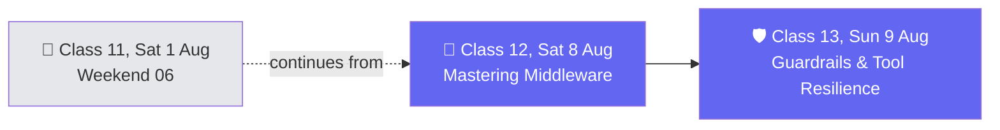

# 🗓️ Weekend 07 — 8-9 Aug — Mastering Middleware & Guardrails

**Agentic AI 3.0 Specialization · Live Class 2026 · Mentor: Mayank Aggarwal**

The middleware notebook started the previous weekend continues straight through — the session's own cells mark a real "9th August" continuation mid-class, finishing with guardrails, PII in depth, and the remaining tool-resilience middlewares.

## 📖 This Weekend's Classes

| Class | Topic | Full write-up | Code |
|---|---|---|---|
| 12 | Mastering Middleware: Limits, Fallback, PII, Retry & Tool Emulation | [classes_summary →](<../classes_summary/12 - 08 Aug - Mastering Middleware.md>) | [`11-12 .../`](<../Weekend 06 - 1 Aug/11-12 - 1-8 Aug - Agents, Memory & Middleware/>) (`MIddleware.ipynb` cells 57–end) — lives in [Weekend 06](<../Weekend 06 - 1 Aug/README.md>) |
| 13 | Guardrails, Todo Lists, Tool Selection & Resilient Tools | [classes_summary →](<../classes_summary/13 - 09 Aug - Guardrails, Todo Lists & Tool Resilience.md>) | *(not yet shared in this repo)* |

Class 12 works through nine built-in LangChain middlewares live: limits, model fallback, `PIIMiddleware` redaction (mapped straight to HIPAA in the real world), retry, and tool call emulation. Class 13 finishes the tool-call-limit carryover, then goes deep on guardrails as a concept distinct from middleware, PII detection internals (including the Luhn-algorithm gotcha), `TodoListMiddleware`, `LLMToolSelectorMiddleware`, and graceful tool error handling with automatic retry.

> ℹ️ **Shared code folder:** Class 12's code lives in `11-12 .../` inside **[Weekend 06](<../Weekend 06 - 1 Aug/README.md>)** (continuous with Class 11). Class 13 doesn't have a dedicated code folder in this repo yet — its notes are compiled from the live session.

## 🔁 Weekend Navigation

⬅️ [Weekend 06 — 1 Aug](<../Weekend 06 - 1 Aug/README.md>) · ⬆️ [Course index](<../README.md>) · ➡️ [Weekend 08 — 15-16 Aug](<../Weekend 08 - 15-16 Aug/README.md>)
