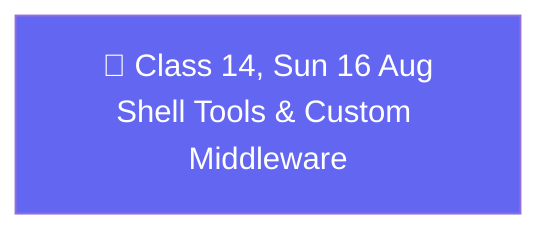

# 🗓️ Weekend 08 — 15-16 Aug — Shell Tools & Custom Middleware

**Agentic AI 3.0 Specialization · Live Class 2026 · Mentor: Mayank Aggarwal**

A single-day weekend (no Saturday session this week) that finishes the built-in middleware catalog with shell access, then spends the bulk of the class writing custom middleware from scratch — the hooks system underneath everything covered so far.

## 📖 This Weekend's Class

| Class | Topic | Full write-up | Code |
|---|---|---|---|
| 14 | Shell Tools & Writing Custom Middleware From Scratch | [classes_summary →](<../classes_summary/14 - 16 Aug - Shell Tools & Custom Middleware.md>) | *(not yet shared in this repo)* |

`ShellToolMiddleware` gives an agent real terminal access — the entire trick behind how Claude Code, Cursor, and GitHub Copilot actually edit files on a real machine. From there, the session opens up the six middleware hooks (`before_agent`, `before_model`, `wrap_model_call`, `after_model`, `wrap_tool_call`, `after_agent`), decorator-based vs. class-based middleware, and the "before runs in declared order, after runs in reverse" execution rule — the same stack (LIFO) logic behind why whichever connection opens first should close last.

## 🔁 Weekend Navigation

⬅️ [Weekend 07 — 8-9 Aug](<../Weekend 07 - 8-9 Aug/README.md>) · ⬆️ [Course index](<../README.md>) · ➡️ [Weekend 09 — 22-23 Aug](<../Weekend 09 - 22-23 Aug/README.md>)
