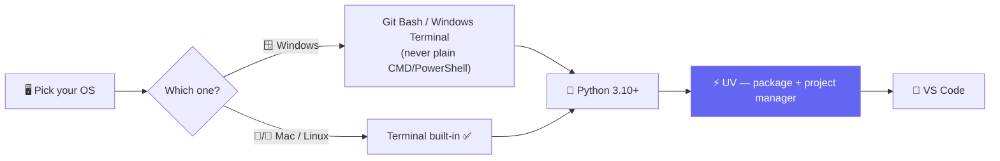
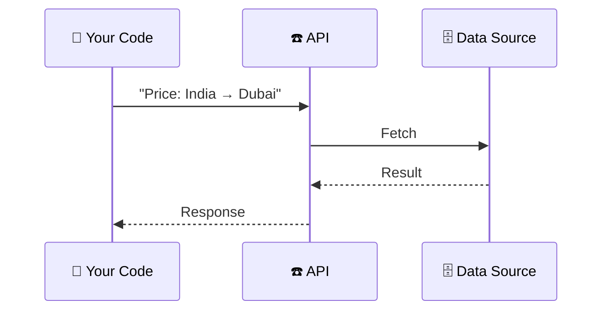

# 🐍 Class 01 — Python for AI: Dev Environment & Fundamentals
### Agentic AI 3.0 Specialization | Live Class 2026

**🎙️ Mentor:** Mayank Aggarwal · **📅 Date:** 27 June 2026 · **⏱️ Duration:** ~4.5 hours

> 📂 **Code for this class:** [`01 - 27 Jun - Python Setup & API Basics/`](<../01 - 27 Jun - Python Setup & API Basics/>)

---

## 💻 Setting Up the Dev Environment



**Why UV, not pip + venv + conda?** One fast tool replaces the juggling act. `uv init` scaffolds a project with its own `pyproject.toml` — the exact Python version and dependency list any teammate's machine can reproduce, the same role `package.json` plays in Node.

**Why VS Code, not Jupyter?** This is an *Agentic AI* course, not classic Data Science — the workflow leans on `.py` scripts, a real terminal (you'll SSH into cloud machines constantly later), and proper debugging.

## 🌐 APIs, Before Any Framework

> *"If I hand you an old keypad phone with no internet and ask for a flight price, you call a travel agent — they fetch it and call you back. That's an API call."*



The live demo built exactly this with `requests` against a currency-exchange API — the same shape every LLM call (OpenAI, Anthropic, Groq...) will take for the rest of the course.

```python
import requests
response = requests.get(url, params=params, timeout=10)  # timeout = hang up if no answer in 10s
```

## 🗣️ Why Frameworks Come Last

> *"Agent is a concept — you should never learn a concept through a framework first. I'll teach you to build agents in plain Python before we touch LangChain."*

This is the entire spine of the course's first phase: fundamentals in raw Python (Classes 01–06), *then* LangChain.

## 📁 What's in the Code Folder

| File | Covers |
|---|---|
| `Python_foundamentals.py` | Variables, types, f-strings, control flow, functions + docstrings |
| `OOPS.py` | First object-oriented Python pass |
| `currency.py` | Live currency-exchange API call with `requests` |
| `functions or tools.py` | Function design that foreshadows agent "tools" |
| `tools.py`, `notebook.ipynb` | Companion exploration notebook |
| `my-first-project/` | A real `uv init` project — `pyproject.toml`, lockfile, and all |

## ✅ Action Items

- [ ] 🐍 Install Python 3.10+, UV, and VS Code
- [ ] 🪟 Windows: install Git Bash or Windows Terminal
- [ ] ⚡ Practice `uv venv` → activate → `uv add requests` → `deactivate`
- [ ] 🌐 Re-run `currency.py` and confirm the live rate against a web search
- [ ] 📖 Look up `if __name__ == "__main__":` before next class

---

## ➡️ Up Next
**[Class 02 — 28 Jun — Python Refresher »](<02 - 28 Jun - Python Refresher.md>)**
📂 Code folder: [`02-03 - 28 Jun & 4 Jul - Python Refresher & Pydantic Deep Dive/`](<../02-03 - 28 Jun & 4 Jul - Python Refresher & Pydantic Deep Dive/>)

---
*Part of the [Live-Class-2026](../README.md) class summary index. ⬅️ [Class 00](<00 - 21 Jun - Course Induction & Roadmap.md>)*
