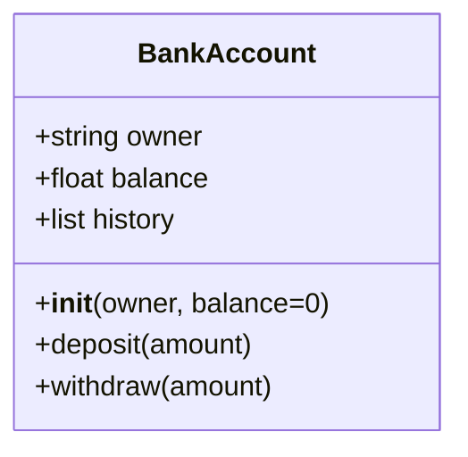
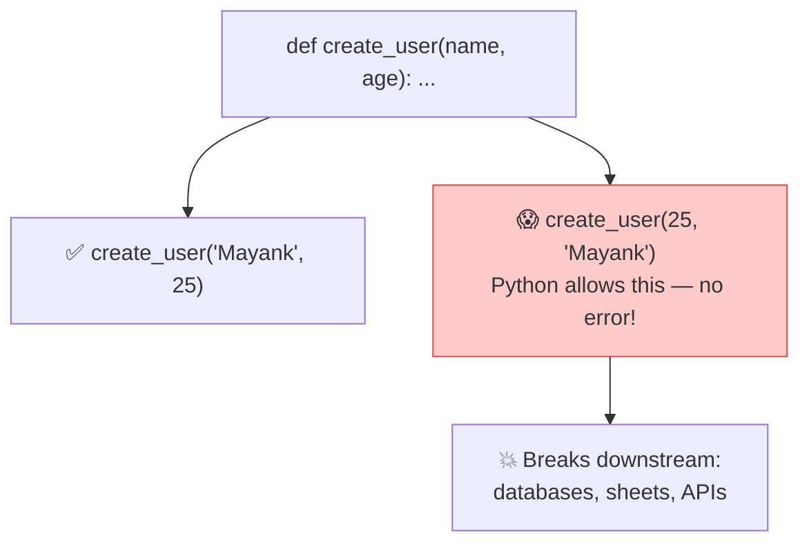

# 🧱 Class 02 — Python Refresher: OOP, Decorators & the Case for Pydantic
### Agentic AI 3.0 Specialization | Live Class 2026

**🎙️ Mentor:** Mayank Aggarwal · **📅 Date:** 28 June 2026 · **⏱️ Duration:** ~4.5 hours

> 📂 **Code for this class:** [`02-03 - 28 Jun & 4 Jul - Python Refresher & Pydantic Deep Dive/`](<../02-03 - 28 Jun & 4 Jul - Python Refresher & Pydantic Deep Dive/>) — files `_0` through `_4`

---

## 🏛️ Object-Oriented Python — The Bank Account Example



Withdrawing more than the balance is rejected by a simple guardrail check inside the class — a small, deliberate preview of the safety checks agents will need later.

## 📦 DataClasses — Killing the Boilerplate

```python
from dataclasses import dataclass, field

@dataclass
class Book:
    title: str
    author: str
    pages_read: int = 0
    tags: list = field(default_factory=list)  # mutable defaults need default_factory
```

`@dataclass` auto-generates `__init__` from type-hinted attributes — but it **does not validate anything at runtime**. That gap is exactly what next class's Pydantic deep-dive closes.

## 🎁 Decorators — Wrapping Without Changing

> *"A decorator is like wrapping a gift — the contents don't change, but you get extra behavior around it."*

```python
import functools

def announce(func):
    @functools.wraps(func)  # preserves func.__name__ for introspection
    def wrapper(*args, **kwargs):
        print(f"Starting {func.__name__}...")
        result = func(*args, **kwargs)
        print(f"Ending {func.__name__}...")
        return result
    return wrapper
```

🔗 **Why this matters later:** agent tool definitions (`@tool`) use exactly this pattern — a function wrapped so something can call it with extra behavior attached.

## ⚠️ The Problem Pydantic Will Solve



Python is dynamically typed — nothing stops the wrong type from silently flowing through a function, all the way into a database or an LLM call. Manual `isinstance()` checks don't scale past a handful of functions. That exact pain is the hook into Class 03.

## 📁 What's in the Code Folder

| File | Covers |
|---|---|
| `_0_basics_refresher.py` | Quick Class 01 recap |
| `_1_data_structures.py` | Lists, dicts, tuples, list-of-dicts |
| `_2_oop_classes.py` | Classes — `BankAccount`, `Book` |
| `_3_error_handling.py` | `try` / `except` patterns |
| `_4_decorators.py` | The wrapper pattern, generic |

(This folder is numbered `_0`–`_14` and also carries the Class 03 Pydantic material — see [Class 03](<03 - 4 Jul - Pydantic Deep Dive.md>) below. Files are self-contained; run any one on its own.)

## ✅ Action Items

- [ ] 🏦 Rebuild `BankAccount` from scratch, don't copy-paste
- [ ] 📦 Write a `@dataclass` and trigger the mutable-default-list bug on purpose
- [ ] 🎁 Write a custom decorator with `functools.wraps`
- [ ] 📖 Read up on `*args` / `**kwargs` before next class

---

## ➡️ Up Next
**[Class 03 — 4 Jul — Pydantic Deep Dive »](<03 - 4 Jul - Pydantic Deep Dive.md>)**

---
*Part of the [Live-Class-2026](../README.md) class summary index. ⬅️ [Class 01](<01 - 27 Jun - Python Setup & API Basics.md>)*
