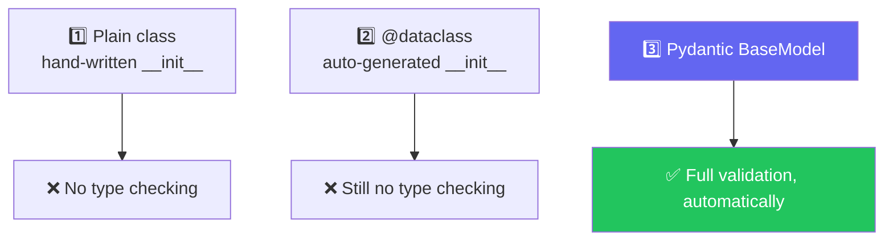
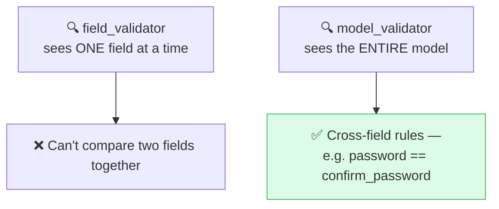
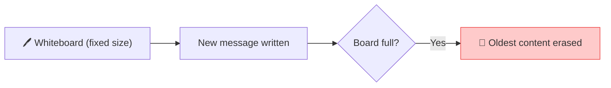

# 🛡️ Class 03 — Pydantic Deep Dive + AI Foundations
### Agentic AI 3.0 Specialization | Live Class 2026

**🎙️ Mentor:** Mayank Aggarwal · **📅 Date:** 4 July 2026 · **⏱️ Duration:** ~4.5 hours

> 📂 **Code for this class:** [`02-03 - 28 Jun & 4 Jul - Python Refresher & Pydantic Deep Dive/`](<../02-03 - 28 Jun & 4 Jul - Python Refresher & Pydantic Deep Dive/>) — files `_5`–`_9` and the [`8_Pydantic/`](<../02-03 - 28 Jun & 4 Jul - Python Refresher & Pydantic Deep Dive/8_Pydantic/>) sub-project

---

## 🧱 Three Ways to Define a "Blueprint" — Only One Actually Validates



```python
from pydantic import BaseModel, Field

class JobApplication(BaseModel):
    full_name: str = Field(min_length=2, max_length=100)
    years_experience: int = Field(gt=0, le=50)
    nationality: str | None = None   # unknown default → None, not "null"
```

Pydantic is reasonable about coercion (`"28"` → `28`) but draws a hard line at genuinely lossy conversions (`28.5` into an `int` field raises `ValidationError`).

## 🧭 `field_validator` vs. `model_validator`



Execution order is fixed: every `field_validator` runs first, per field — *then* `model_validator` runs once the whole object is individually valid.

## 🪆 Nested Models, and Special Types Worth Knowing

- Nested `BaseModel`s mirror nested JSON — exactly the shape of most real API payloads and LLM structured output.
- `EmailStr`, `HttpUrl` save you from writing your own regex.
- `SecretStr` masks sensitive values (API keys, passwords) in logs — worth using early, since this course handles keys constantly.

## 🧠 AI Vocabulary — Five Terms Before Building an Agent

| Term | One-line mental model |
|---|---|
| **LLM** | Predicts the next *token*, not the next word — pattern completion, not understanding |
| **Tokens** | The billing currency — ~¾ of a word each; output tokens cost more than input |
| **Vector Embeddings** | Words become coordinates; similar meaning → close together in that space |
| **Context Window** | A whiteboard of fixed size — oldest content quietly erased once it's full |
| **Parameters** | Billions of fixed weights set at training time — not the same thing as tokens |



## 📁 What's in the Code Folder

| File | Covers |
|---|---|
| `_5_calling_a_real_api.py` | Real currency API, revisited |
| `_6_fake_ai_call.py` | OpenAI-shaped response, zero dependency |
| `_7_ai_call_free_and_paid.py` | Groq + OpenRouter (free), OpenAI (paid) |
| `_8_pydantic_with_ai.py` | Validating LLM output with `BaseModel` |
| `_9_api_call_with_structure.py` | File `_5`'s API, now Pydantic-validated |
| [`8_Pydantic/`](<../02-03 - 28 Jun & 4 Jul - Python Refresher & Pydantic Deep Dive/8_Pydantic/>) | Standalone Pydantic-from-scratch mini project + notebook |

## ✅ Action Items

- [ ] 🛡️ Define a `BaseModel` with `Field()` constraints from memory
- [ ] 🧩 Write a `field_validator` and a `model_validator` — know *why* each exists
- [ ] 🪆 Nest one Pydantic model inside another
- [ ] 📖 Know **LLM, Token, Vector Embedding, Context Window, Parameters** cold

---

## ➡️ Up Next
**[Class 04 — 5 Jul — Anatomy of an Agent »](<04 - 5 Jul - Anatomy of an Agent.md>)**
📂 Code folder: [`04-05 - 5 Jul & 11 Jul - Anatomy of an Agent & The Agentic Loop/`](<../04-05 - 5 Jul & 11 Jul - Anatomy of an Agent & The Agentic Loop/>)

---
*Part of the [Live-Class-2026](../README.md) class summary index. ⬅️ [Class 02](<02 - 28 Jun - Python Refresher.md>)*
