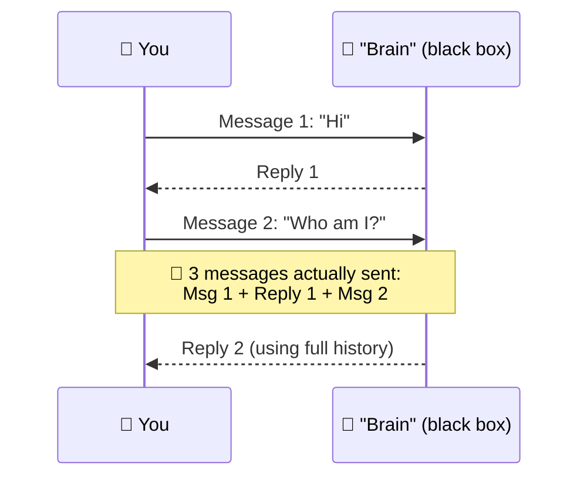
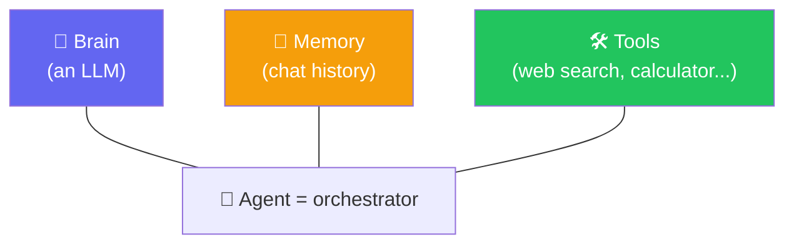
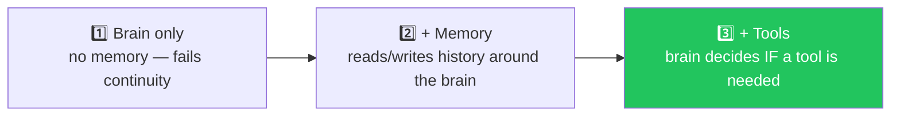

# 🤖 Class 04 — LLMs Are Stateless & The Anatomy of an Agent
### Agentic AI 3.0 Specialization | Live Class 2026

**🎙️ Mentor:** Mayank Aggarwal · **📅 Date:** 5 July 2026 · **⏱️ Duration:** ~4.5 hours

> 📂 **Code for this class:** [`04-05 - 5 Jul & 11 Jul - Anatomy of an Agent & The Agentic Loop/Project 0/`](<../04-05 - 5 Jul & 11 Jul - Anatomy of an Agent & The Agentic Loop/Project 0/>) — files `_01`–`_04`

---

## 🧠 The Big Idea: LLM Calls Are Stateless

Every AI call — ChatGPT, Claude, an API request — gives an input and gets an output. It remembers nothing on its own. What *looks* like memory in a chat UI is really: **the entire history gets resent, every single message.** That's also exactly why long conversations get slow, expensive, and forgetful — once the context window fills, the oldest content is quietly dropped to make room.

## 🏗️ Anatomy of an Agent — Brain, Memory, Tools

> *"Think of an agent as hiring an intern. A great brain with no tools still can't act in the world. The agent itself has zero intelligence — it's plumbing moving data between brain, memory, and tools."*

### Building It Up in Three Steps

The brain decides whether a tool call is even necessary — a casual "hi" gets a direct reply; a factual question triggers a tool call, then a **second** brain call to turn the raw tool result into a clean answer. That two-call shape (decide → act → decide again) is the seed of the full agentic loop built next class.

## 📁 What's in the Code Folder

| File | Covers |
|---|---|
| `_01_ai_model_vs_chatbot_vs_agent.py` | Structural comparison of the three, no API calls |
| `_02_calling_the_ai_paid_and_free.py` | Real calls: OpenAI, Anthropic, Groq, OpenRouter |
| `_03_structuring_with_pydantic.py` | Structured JSON extraction, validated |
| `_04_giving_it_a_tool.py` | A weather tool, called manually |

## ✅ Action Items

- [ ] 🧠 Explain "LLM calls are stateless" in your own words
- [ ] 🖊️ Practice the context-window "whiteboard" analogy on someone else
- [ ] 🔌 Get a free OpenRouter key and hit a model directly
- [ ] 🏗️ Memorize Brain → Memory → Tools — every framework maps onto this

---

## ➡️ Up Next
**[Class 05 — 11 Jul — The Agentic Loop (Pure Python) »](<05 - 11 Jul - The Agentic Loop.md>)**

---
*Part of the [Live-Class-2026](../README.md) class summary index. ⬅️ [Class 03](<03 - 4 Jul - Pydantic Deep Dive.md>)*
