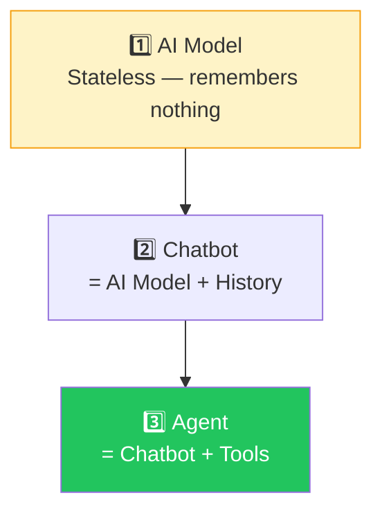
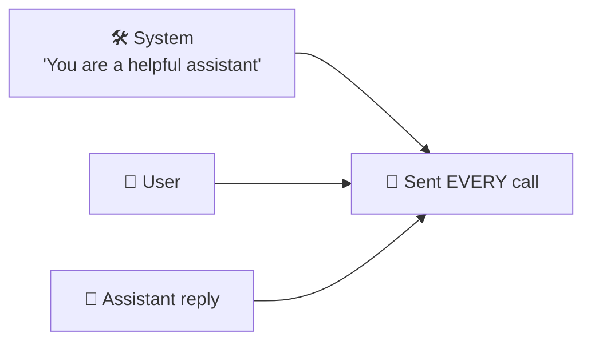
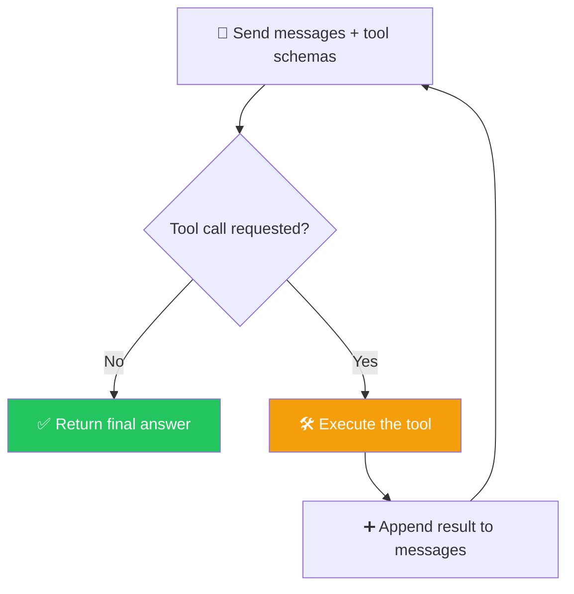

# 🔁 Class 05 — Building Real Agents in Pure Python: The Agentic Loop
### Agentic AI 3.0 Specialization | Live Class 2026

**🎙️ Mentor:** Mayank Aggarwal · **📅 Date:** 11 July 2026 · **⏱️ Duration:** ~4.5 hours

> 📂 **Code for this class:** [`04-05 - 5 Jul & 11 Jul - Anatomy of an Agent & The Agentic Loop/Project 0/`](<../04-05 - 5 Jul & 11 Jul - Anatomy of an Agent & The Agentic Loop/Project 0/>) — files `_05`–`_07`

---

> *"I know I would have started with LangChain to make everyone happy — but now you'll actually **appreciate** LangChain instead of just copy-pasting it."*

## 🪜 Three-Layer Hierarchy: AI Model → Chatbot → Agent



## 💬 System / User / Assistant



Even a single "hi" transmits the system message + user message + assistant reply-so-far — 3 messages — confirmed by inspecting the raw request payload live.

## 📦 Structured Output — Why Free Text Isn't Enough

> *"Would you rather parse `'Today weather is 25 degrees'` out of a sentence, or just receive `{"temperature": 25}`?"*

Two ways to get structure: (1) a hand-written prompt instruction telling the model to reply in a specific JSON shape, or (2) a reusable Pydantic schema. Providers also support a native structured-output mode — trivial once LangChain arrives next class.

## 🧠 The Agentic Loop



```python
for _ in range(max_iterations):        # e.g. max_iterations = 4
    response = call_ai(messages, tools=tool_schemas)
    if response.no_tool_call:
        return response.content
    result = call_tool(response.tool_name, response.tool_args)
    messages.append({"role": "tool", "content": result})
    # loop again — the AI is stateless, it must be re-called with the tool's result
```

The AI is called *again* after a tool runs because it never automatically "knows" the tool's output — that result has to be explicitly fed back in as a new message before the model can use it. `max_iterations` caps runaway loops.

## 📁 What's in the Code Folder

| File | Covers |
|---|---|
| `_05_teaching_it_to_choose.py` | Tool schema + the model choosing and calling the tool itself |
| `_06_project_zero_agent.py` | The full loop, terminal chat, one tool |
| `_07_streamlit_app.py` | Full loop + Streamlit UI, three tools (weather, calculator, currency) |

## ✅ Action Items

- [ ] 🐍 Step through every file in `Project 0/`, in numeric order
- [ ] 🔑 Get a free Groq key and confirm the OpenAI-compatible client works
- [ ] 🧠 Explain, unprompted, why the loop re-calls the AI after a tool runs
- [ ] 📦 Define a Pydantic schema for a structured AI reply

---

## ➡️ Up Next
**[Class 06 — 12 Jul — Introduction to LangChain »](<06 - 12 Jul - Introduction to LangChain.md>)**
📂 Code folder: [`06 - 12 Jul - Introduction to LangChain/`](<../06 - 12 Jul - Introduction to LangChain/>)

---
*Part of the [Live-Class-2026](../README.md) class summary index. ⬅️ [Class 04](<04 - 5 Jul - Anatomy of an Agent.md>)*
