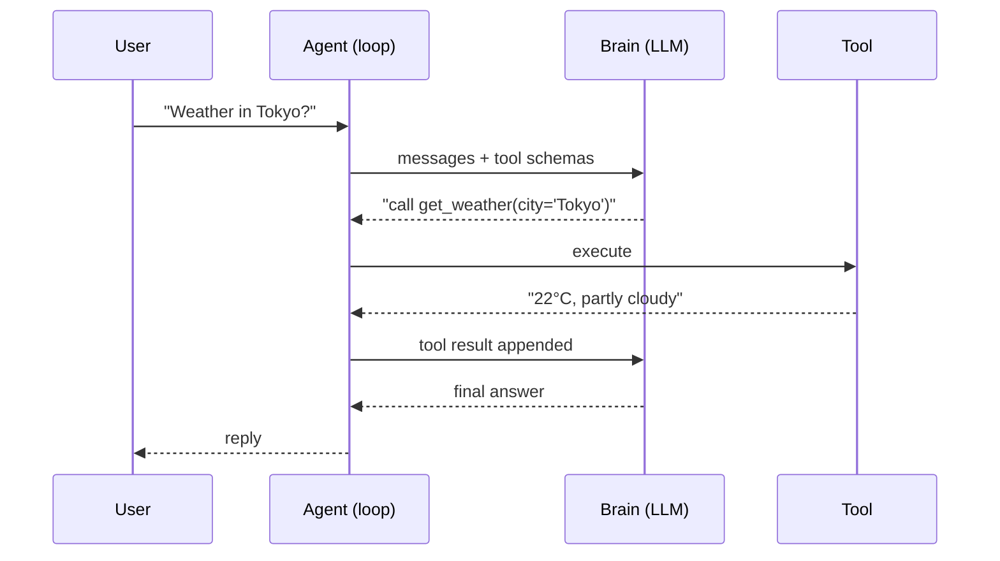
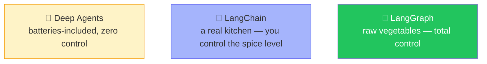

# 🔗 Class 06 — LangChain Begins: From Raw Python to `create_agent()`
### Agentic AI 3.0 Specialization | Live Class 2026

**🎙️ Mentor:** Mayank Aggarwal · **📅 Date:** 12 July 2026 · **⏱️ Duration:** ~4.5 hours

> 📂 **Code for this class:** [`06 - 12 Jul - Introduction to LangChain/`](<../06 - 12 Jul - Introduction to LangChain/>)
> This session opened by finishing the raw-Python agent from Class 05 — its final "tools calling themselves" version lives at the end of [`Project 0/`](<../04-05 - 5 Jul & 11 Jul - Anatomy of an Agent & The Agentic Loop/Project 0/>) — before LangChain formally begins below.

---

## 🛠️ Finishing the Raw-Python Agent



> *"If ChatGPT told you 'go search Google yourself and paste the results back to me' — would that be useful? The whole point of an agent is that IT calls the tool, not you."*

## 🤔 Why LangChain — Three Levels of Control



LangChain's own definition: *agent = model + harness*. `create_agent()` is that minimal, configurable harness — the prompts, tools, and any middleware shaping behavior. This course starts here because building real software needs that level of control, not a black box.

## ⚡ `create_agent()` — The One-Liner

```python
from langchain.agents import create_agent

agent = create_agent(
    model="openai:gpt-4o-mini",
    tools=[get_weather],
    system_prompt="You are a helpful weather assistant.",
)
result = agent.invoke({"messages": [{"role": "user", "content": "Weather in San Francisco?"}]})
```

Printing `result["messages"]` reveals the exact same anatomy built by hand on Day 5 — `HumanMessage → AIMessage (tool call) → ToolMessage → AIMessage (final)` — just wrapped in LangChain's object format. The trade-off: real convenience, at the cost of a little visibility and a little latency (extra ID generation and bookkeeping under the hood).

## 📁 What's in the Code Folder

| File | Covers |
|---|---|
| `langchain_basics.py` | First `create_agent()` calls, model swapping |
| `langchain_agents.py` | Tools via `@tool`, the full loop delegated to LangChain |
| `main.py` | Entry point tying the project together |
| `.example.env` | Provider key template — copy to `.env`, never commit the real one |

## ✅ Action Items

- [ ] 🏗️ `uv add langchain langchain-openai langchain-anthropic`
- [ ] 🔐 Practice `.env` + `.gitignore` + `.env.example` — never let a real key hit GitHub
- [ ] ⚡ Build the weather agent with `create_agent()`, print `result["messages"]`, map each message back to Day 5's loop
- [ ] 🛠️ Wrap one of your own functions with `@tool` and a clear docstring

---

## ➡️ Up Next
**[Class 07 — 18 Jul — LangChain Family, Harness Engineering & First Models »](<07 - 18 Jul - LangChain Family & Harness Engineering.md>)**
📂 Code folder: [`07-08 - 18-19 Jul - LangChain Family & the Model Layer/`](<../07-08 - 18-19 Jul - LangChain Family & the Model Layer/>)

---
*Part of the [Live-Class-2026](../README.md) class summary index. ⬅️ [Class 05](<05 - 11 Jul - The Agentic Loop.md>)*
