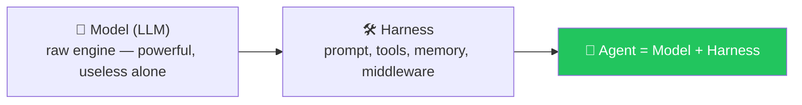
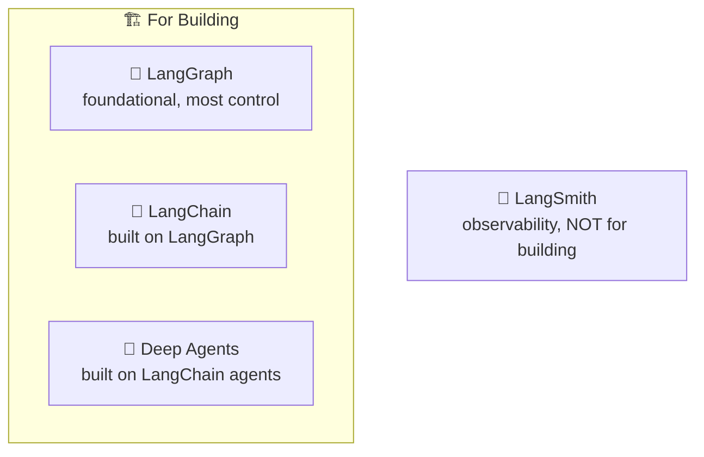
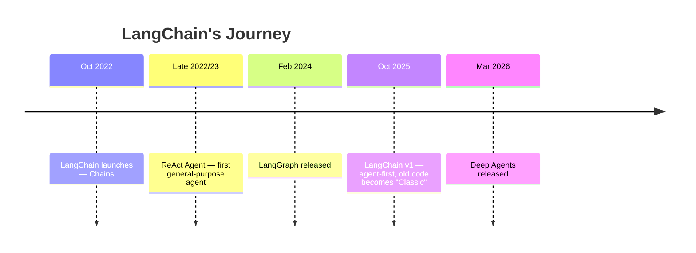

# 🚗 Class 07 — The LangChain Family, Harness Engineering & First Models
### Agentic AI 3.0 Specialization | Live Class 2026

**🎙️ Mentor:** Mayank Aggarwal · **📅 Date:** 18 July 2026 · **⏱️ Duration:** ~4.5 hours

> 📂 **Code for this class:** [`07-08 - 18-19 Jul - LangChain Family & the Model Layer/`](<../07-08 - 18-19 Jul - LangChain Family & the Model Layer/>) — see [`Notebook For Reference/01_landscape_student_notes.ipynb`](<../07-08 - 18-19 Jul - LangChain Family & the Model Layer/Notebook For Reference/01_landscape_student_notes.ipynb>)

---

## 🚙 Model = Engine, Harness = Everything Else, Agent = Car



> *"Even Claude Code and ChatGPT are, at their core, this same brain wrapped in connectors, skills, memory, and web search — harnessed."* **Harness Engineering** is exactly the discipline of building that wrapping well.

## 🏠 The LangChain Family



⚠️ **LangFuse is not part of this family** — independent observability platform, shares "Lang" in the name only. Intended mastery order: **LangChain → LangGraph → Deep Agents.**

## 📜 The Timeline



⚠️ Most tutorials online still teach **LangChain Classic** (pre-v1). This course teaches **v1.0+ only**.

## 🧠 `init_chat_model` — One Interface, Every Provider

```python
from langchain.chat_models import init_chat_model
model = init_chat_model("openai:gpt-5")
response = model.invoke("Tell me what LangChain is")
```

Swap the provider string, keep the rest of the code identical — the entire value proposition of the abstraction layer.

```python
from langchain_core.messages import SystemMessage, HumanMessage
messages = [
    SystemMessage(content="You are a pirate. Answer everything in pirate language."),
    HumanMessage(content="What is the capital of France?"),
]
```

## 📁 What's in the Code Folder

| Path | Covers |
|---|---|
| [`Langchain Practical/langchain-course/`](<../07-08 - 18-19 Jul - LangChain Family & the Model Layer/Langchain Practical/langchain-course/>) | Real `uv`-based LangChain project — `.env`, models, messages |
| [`Notebook For Reference/01_landscape_student_notes.ipynb`](<../07-08 - 18-19 Jul - LangChain Family & the Model Layer/Notebook For Reference/01_landscape_student_notes.ipynb>) | LangChain family + timeline, worked through live |
| [`Notebook For Reference/02_03_environment_models_messages_student_notes.ipynb`](<../07-08 - 18-19 Jul - LangChain Family & the Model Layer/Notebook For Reference/02_03_environment_models_messages_student_notes.ipynb>) | Environment setup, `init_chat_model`, message types (continues into [Class 08](<08 - 19 Jul - Inside the Model.md>)) |

## ✅ Action Items

- [ ] 🏗️ Set up a fresh `uv`-based LangChain project (`.env`, `.gitignore`, `.env.example`)
- [ ] 🔬 Run the `create_agent` sanity check on both Colab and VS Code
- [ ] 🧠 Practice `init_chat_model` with two different providers
- [ ] 💬 Try `SystemMessage` + `HumanMessage` with a fun persona

---

## ➡️ Up Next
**[Class 08 — 19 Jul — Inside the Model: Parameters, Streaming, Tools & Structured Output »](<08 - 19 Jul - Inside the Model.md>)**

---
*Part of the [Live-Class-2026](../README.md) class summary index. ⬅️ [Class 06](<06 - 12 Jul - Introduction to LangChain.md>)*
