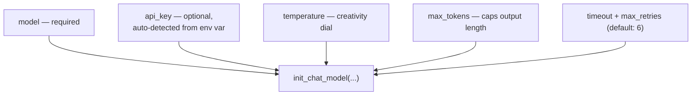
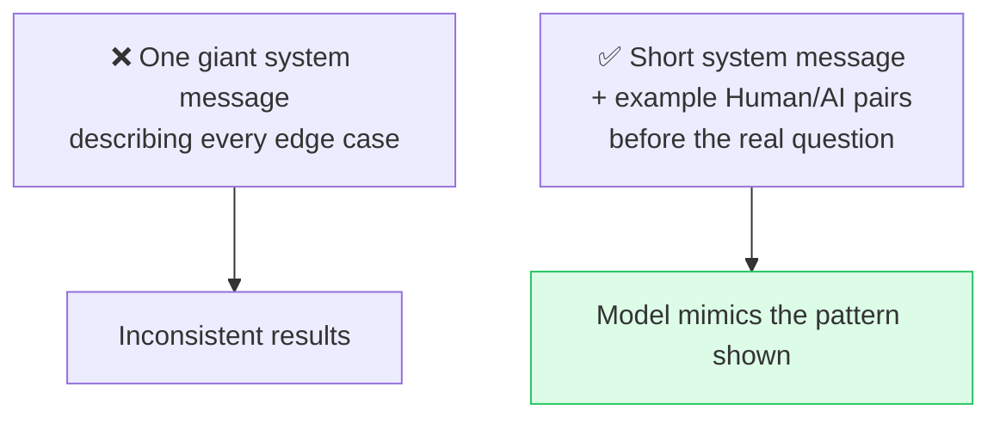

# 🧠 Class 08 — Inside the Model: Parameters, Streaming, Tools & Structured Output
### Agentic AI 3.0 Specialization | Live Class 2026

**🎙️ Mentor:** Mayank Aggarwal · **📅 Date:** 19 July 2026 · **⏱️ Duration:** ~4.5 hours

> 📂 **Code for this class:** [`07-08 - 18-19 Jul - LangChain Family & the Model Layer/Notebook For Reference/`](<../07-08 - 18-19 Jul - LangChain Family & the Model Layer/Notebook For Reference/>) — `02_03_...`, `04_05_prompt_templates_structured_output_student_notes.ipynb`

---

## ⚙️ Model Parameters



`max_tokens` is the fix for a very common "response exceeded limit" error on free-tier providers.

## 💬 Few-Shot Prompting Beats a Bloated System Prompt



```python
from langchain_core.messages import SystemMessage, HumanMessage, AIMessage
messages = [
    SystemMessage(content="You are a helpful support assistant."),
    HumanMessage(content="Example question..."),
    AIMessage(content="Example ideal answer..."),
    HumanMessage(content="Actual user question here"),
]
```

## 📡 Streaming vs. 📦 Batching

```python
for chunk in model.stream("Why do parrots have colorful feathers?"):
    print(chunk.text, end="", flush=True)

responses = model.batch([Q1, Q2, Q3])   # independent requests, run in parallel
```

Three ways to call a model, now complete: `.invoke()` (single), `.stream()` (progressive), `.batch()` (parallel) — and `batch_as_completed()` combines the last two.

## 🛠️ Tool Binding — Deciding vs. Doing

```python
model_with_tools = model.bind_tools([get_weather])
response = model_with_tools.invoke("What is the weather in Delhi?")
print(response.tool_calls)   # → [{'name': 'get_weather', 'args': {'location': 'Delhi'}, 'id': '...'}]
```

🔑 **Binding a tool never executes it.** `.invoke()` after binding only makes the model *decide* whether and how to call a tool — `response.content` comes back empty, and the real instruction lives in `response.tool_calls`. Actually running the function and feeding the result back is still on the developer — exactly the loop built by hand in Class 05.

## 📐 Structured Output Meets the Model

```python
from pydantic import BaseModel, Field

class Email(BaseModel):
    subject: str = Field(description="The email subject line")
    body: str = Field(description="The email body")

structured_model = model.with_structured_output(Email)
response = structured_model.invoke("Write a leave email to my manager")
print(type(response))  # <class '__main__.Email'> — not a string!
```

## 📁 What's in the Code Folder

| Path | Covers |
|---|---|
| [`Notebook For Reference/02_03_environment_models_messages_student_notes.ipynb`](<../07-08 - 18-19 Jul - LangChain Family & the Model Layer/Notebook For Reference/02_03_environment_models_messages_student_notes.ipynb>) | Model parameters, message anatomy |
| [`Notebook For Reference/04_05_prompt_templates_structured_output_student_notes.ipynb`](<../07-08 - 18-19 Jul - LangChain Family & the Model Layer/Notebook For Reference/04_05_prompt_templates_structured_output_student_notes.ipynb>) | Prompt templates + first structured-output pass |
| [`Notebook For Reference/Revision_Parts_1-4.ipynb`](<../07-08 - 18-19 Jul - LangChain Family & the Model Layer/Notebook For Reference/Revision_Parts_1-4.ipynb>) | Consolidated revision notebook, shared before Class 09 |

## ✅ Action Items

- [ ] ⚙️ Set `temperature`, `max_tokens`, `timeout`, `max_retries` explicitly and observe the differences
- [ ] 💬 Recreate few-shot prompting and compare against a system-message-only version
- [ ] 📡 Try `.stream()` on a long prompt; try `.batch()` on 3 independent questions
- [ ] 🛠️ `bind_tools()` on a function, `.invoke()`, inspect `response.tool_calls`
- [ ] 📐 Use `with_structured_output()` to get a real typed object back

---

## ➡️ Up Next
**[Class 09 — 25 Jul — Structured Output Mastery: Building CineBot »](<09 - 25 Jul - Structured Output Mastery.md>)**
📂 Code folder: [`09-10 - 25-26 Jul - Structured Output & Tools (CineBot)/`](<../09-10 - 25-26 Jul - Structured Output & Tools (CineBot)/>)

---
*Part of the [Live-Class-2026](../README.md) class summary index. ⬅️ [Class 07](<07 - 18 Jul - LangChain Family & Harness Engineering.md>)*
