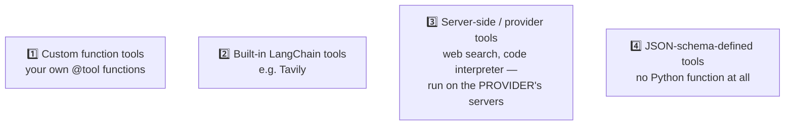

# 🛠️ Class 10 — Tools Deep Dive: Giving CineBot Hands
### Agentic AI 3.0 Specialization | Live Class 2026

**🎙️ Mentor:** Mayank Aggarwal · **📅 Date:** 26 July 2026 · **⏱️ Duration:** ~5 hours

> 📂 **Code for this class:** [`09-10 - 25-26 Jul - Structured Output & Tools (CineBot)/Langchain-Tools.ipynb`](<../09-10 - 25-26 Jul - Structured Output & Tools (CineBot)/Langchain-Tools.ipynb>) · [`Langchain_Till_Agents.ipynb`](<../09-10 - 25-26 Jul - Structured Output & Tools (CineBot)/Langchain_Till_Agents.ipynb>) · [`Assignment & Questions/`](<../09-10 - 25-26 Jul - Structured Output & Tools (CineBot)/Assignment & Questions/>)

---

## ✋ A Brain Without Hands

CineBot has a solid brain and always replies in clean structured output — but asked *"Is Interstellar showing tonight at 7pm?"* it has no idea. A model, however smart, cannot act in the world. That gap is exactly what tools close.

```python
from langchain_core.tools import tool

@tool
def check_showtimes(movie_title: str) -> str:
    """Get available showtimes for a given movie."""
    return "Interstellar: 7:00 PM, 9:30 PM"
```

The **function name** becomes the tool's name; the **docstring** becomes its description — the exact text the model reads to decide when to reach for it. *"Tools are just glorified API calls, or functions. If you can write a clean Python function, you can write a good tool."*

## 📐 Argument Schemas: `Field()` Beats Plain Type Hints

```python
class SeatBookingInput(BaseModel):
    movie_title: str = Field(description="Exact movie title")
    seat_count: int = Field(gt=0, description="Number of seats")
    preferred_row: Literal["front", "middle", "back"] = Field(default="middle")

@tool(args_schema=SeatBookingInput)
def book_seats(movie_title: str, seat_count: int, preferred_row: str) -> str:
    """Book seats for a movie."""
```

A richer schema costs a few more tokens upfront — trivial next to the cost of a malformed call, a caught error, and a retry.

## 🚫 Two Reserved Names: `config` and `runtime`

A tool argument named `config` or `runtime` **defines fine** but fails at runtime the moment an agent tries to call it — both names are reserved for LangChain's own internal use. The error only appears at call time, not definition time, because the same function might be reused somewhere those names aren't reserved at all.

## 🔗 Binding ≠ Running

The model can never call a tool itself — not now, not with any framework. Binding only lets it *request* a call (`response.tool_calls`, with empty `response.content`); a full agent is what actually executes it.

## 📚 Four Kinds of Tools



## 🪞 `ToolRuntime` — The Mirror Analogy

A model only ever sees the arguments a tool explicitly declares (its "reflection"). A `runtime: ToolRuntime` parameter is invisible to the model but gives the tool's own code access to `state` (short-term memory), `context` (immutable config, e.g. paid-plan status), `store` (long-term, cross-conversation memory), and `stream_writer` (live progress updates).

```python
from langgraph.store.memory import InMemoryStore
from langchain.tools import ToolRuntime, tool

loyalty_store = InMemoryStore()

@tool
def save_favorite_genre(customer_id: str, genre: str, runtime: ToolRuntime) -> str:
    """Save a customer's favorite movie genre for future visits."""
    runtime.store.put(customer_id, "preferences", {"favorite_genre": genre})
    return f"Got it! I'll remember you like {genre} movies."
```

## 📁 What's in the Code Folder

| Path | Covers |
|---|---|
| [`Langchain-Tools.ipynb`](<../09-10 - 25-26 Jul - Structured Output & Tools (CineBot)/Langchain-Tools.ipynb>) | `@tool`, `args_schema`, `ToolRuntime`, memory-backed tools |
| [`Langchain_Till_Agents.ipynb`](<../09-10 - 25-26 Jul - Structured Output & Tools (CineBot)/Langchain_Till_Agents.ipynb>) | Everything up through tools, consolidated |
| [`Assignment & Questions/`](<../09-10 - 25-26 Jul - Structured Output & Tools (CineBot)/Assignment & Questions/>) | Practical assignment + interview questions from real candidate experiences |

## ✅ Action Items

- [ ] 🛠️ Write a `@tool` function with a clear docstring
- [ ] 📐 Build a Pydantic `args_schema`, compare `.args` with and without it
- [ ] 🚫 Name a tool argument `config` and watch it fail at call time
- [ ] 🪞 Add `runtime: ToolRuntime`, confirm the model never sees it in `.args`
- [ ] 🎬 Recreate `save_favorite_genre` / `recall_favorite_genre` with `InMemoryStore`

---

## ➡️ Up Next
**[Class 11 — 1 Aug — Agents, Middleware & Memory: Giving CineBot a Mind »](<11 - 01 Aug - Agents, Middleware & Memory.md>)**
📂 Code folder: [`11-12 - 1-8 Aug - Agents, Memory & Middleware/`](<../11-12 - 1-8 Aug - Agents, Memory & Middleware/>)

---
*Part of the [Live-Class-2026](../README.md) class summary index. ⬅️ [Class 09](<09 - 25 Jul - Structured Output Mastery.md>)*
