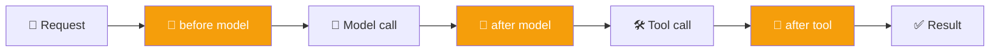

# 🧵 Class 12 — Mastering Middleware: Control, Guardrails & Human-in-the-Loop
### Agentic AI 3.0 Specialization | Live Class 2026

**🎙️ Mentor:** Mayank Aggarwal · **📅 Date:** 8 August 2026 · **⏱️ Duration:** ~4.5 hours

> 📂 **Code for this class:** [`11-12 - 1-8 Aug - Agents, Memory & Middleware/MIddleware.ipynb`](<../11-12 - 1-8 Aug - Agents, Memory & Middleware/MIddleware.ipynb>)
> 🔗 Live Colab: [Middleware notebook](https://colab.research.google.com/drive/1Qt9uU2HhDvtFTWwbbFBYxK86jJypv1w_?usp=sharing)

---

## 🎛️ Why Middleware Exists

Nothing stops an agent from replying rudely if asked, or automatically flags personal data handed to it — not a flaw in the model, tools, or prompt, but a gap in what happens *between* them. Middleware hooks into six points: before/after the agent runs, before/after the model is called, before/after a tool is called. Google's ADK calls the same concept a "callback" — the pattern is universal, not LangChain-specific.



## 📝 Six Built-in Middlewares

| Middleware | Solves |
|---|---|
| **Summarization** | Growing context — condenses older messages once a token/message trigger fires, keeps the last N intact |
| **Human-in-the-Loop** | Pauses before a risky **tool call** so a human can approve / edit / reject it |
| **Model Call Limit** | Caps how many times the agent can call the model in one run |
| **Tool Call Limit** | Caps how many times a specific tool can fire in one run |
| **Model Fallback** | Routes to a secondary model automatically if the primary genuinely fails (404, expired key) |
| **PII Detection** | Redacts or masks sensitive data (email, credit card, custom regex like Aadhaar) before it reaches the model |

```python
from langchain.agents.middleware import SummarizationMiddleware, HumanInTheLoopMiddleware, PIIMiddleware

middleware = [
    SummarizationMiddleware(model="anthropic:claude-haiku", trigger=("tokens", 4000), keep=("messages", 10)),
    HumanInTheLoopMiddleware(interrupt_on={"send_email": {"allowed_decisions": ["approve", "edit", "reject"]}}),
    PIIMiddleware("email", strategy="redact", apply_to_input=True),
]
```

## ✋ Human-in-the-Loop Only Applies to Tool Calls

Everything before a tool call is the model reasoning; the tool call is the "hands" actually changing something in the world — that's the moment worth pausing on. A support bot escalating to a human is a **transfer** (the agent steps out entirely), not HITL — HITL keeps the agent in the loop, just paused for a decision.

## 🕵️ Guardrail vs. Middleware

A **guardrail** is the goal (protecting the agent from doing something undesirable). **Middleware** is the mechanism that implements it. They aren't competing systems — guardrails are applied *as* middleware.

## 🗺️ LangChain + Middleware vs. Dropping to LangGraph

Sufficient for most agents, including simple RAG chatbots. LangGraph earns its place when an application needs precise, deterministic control over checkpointers, stores, and interrupts beyond what LangChain's abstractions expose.

## 📁 What's in the Code Folder

| Path | Covers |
|---|---|
| [`MIddleware.ipynb`](<../11-12 - 1-8 Aug - Agents, Memory & Middleware/MIddleware.ipynb>) | All six built-in middlewares, worked live |
| [`Middleware-Architecture-Sketch.ipynb`](<../11-12 - 1-8 Aug - Agents, Memory & Middleware/Middleware-Architecture-Sketch.ipynb>) | Early loop-diagram sketch |
| [`Agent-Middleware-Architecture.excalidraw`](<../11-12 - 1-8 Aug - Agents, Memory & Middleware/Agent-Middleware-Architecture.excalidraw>) / `.pdf` | The full whiteboard diagram of the agent + middleware architecture |

## ✅ Action Items

- [ ] 🧵 Recreate `SummarizationMiddleware` with your own `trigger`/`keep` values
- [ ] ✋ Build the `HumanInTheLoopMiddleware` send-email demo, resolve the interrupt yourself
- [ ] 🔢 Add a model call limit and a tool call limit, trigger both deliberately
- [ ] 🔀 Set up `ModelFallbackMiddleware` and simulate a primary-model failure
- [ ] 🕵️ Write one custom PII detector with `re` for an ID format relevant to you

---

## 🏁 This Is the Latest Class Documented Here

New sessions land every weekend — check the [root README](../README.md) for the live index as new class folders and summaries are added.

---
*Part of the [Live-Class-2026](../README.md) class summary index. ⬅️ [Class 11](<11 - 01 Aug - Agents, Middleware & Memory.md>)*
